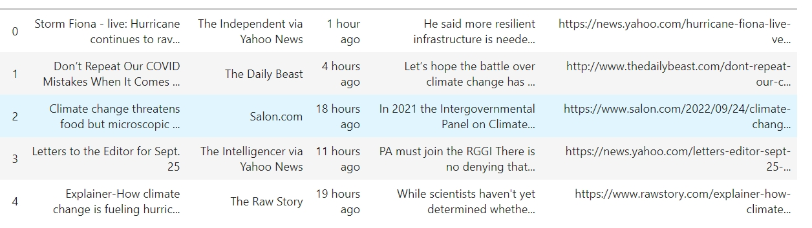

# Yahooo News Scrapper -Climate Change News

 
In today’s crowded information landscape, mainstream news media continue to play an important role in shaping how we understand and act on climate change. The average person is now much more likely to be exposed to news coverage on climate change now than in the past. Yet, we don't have a clear understanding of how the content of this news coverage has changed over time, despite likely playing an important part in fostering or inhibiting public support and engagement in climate action.
 
 
In this project, I have attempted to webscrap all news articles on climate change from yahoo news website.
 

